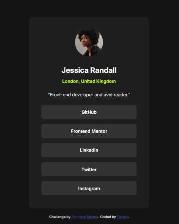

# Frontend Mentor - Social links profile solution

This is a solution to the [Social links profile challenge on Frontend Mentor](https://www.frontendmentor.io/challenges/social-links-profile-UG32l9m6dQ). Frontend Mentor challenges help you improve your coding skills by building realistic projects. 

## Table of contents

- [Overview](#overview)
  - [Screenshot](#screenshot)
- [My process](#my-process)
  - [Built with](#built-with)
  - [What I learned](#what-i-learned)
  - [Continued development](#continued-development)
  - [Useful resources](#useful-resources)
- [Author](#author)

## Overview

### Screenshot

### Links

- Solution URL: [GitHub Repository](https://github.com/Flarien/3-social-links-profile)
- Live Site URL: [GitHub Pages](https://flarien.github.io/3-social-links-profile/)

## My process

### Built with

- Semantic HTML5
- CSS custom properties
- Flexbox
- Media Query

### What I learned

I started this project to revisit and practice the foundations of web development. Through this challenge, I reviewed essential skills, including HTML structure, CSS styling, and class management, while reinforcing my understanding of the basics.

### Continued development

I plan to continue practicing consistently, gradually tackling more complex projects to expand my skills and improve my abilities. I’ll keep challenging myself with progressively more advanced tasks and updating my progress here.

### Useful resources

## Author

- Website - [FlarienDev](https://flariendev.com.ar)
- Frontend Mentor - [@Flarien](https://www.frontendmentor.io/profile/Flarien)
- LinkedIn - [@flavia-s-briglia](https://www.linkedin.com/in/flavia-s-briglia/)
